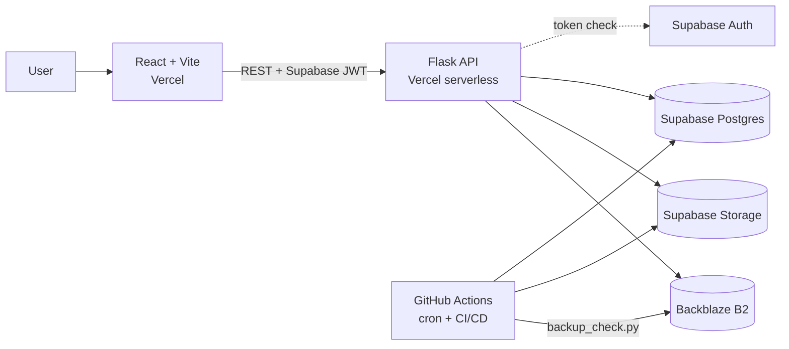

# CloudVault — Multi-Provider Backup & Disaster Recovery (100% free stack)

Upload a file once; CloudVault keeps **SHA-256-verified copies in Backblaze B2 and Supabase Storage**, shows backup health, and restores from whichever provider is still healthy.
Every service used has a free plan that Backblaze/Supabase/Vercel/GitHub document as **not requiring a credit card**. No AWS, Azure, Docker, Kubernetes, Terraform, VMs, Celery, Redis, Jenkins, Prometheus or Grafana.

## 1. Free services used
| Purpose | Service | Free allowance |
|---|---|---|
| Storage copy #1 | Backblaze B2 (S3-compatible API) | 10 GB |
| Storage copy #2 | Supabase Storage | 1 GB, 50 MB max object |
| Metadata DB + login | Supabase Postgres + Auth | 500 MB DB, 50k users |
| Frontend + backend hosting | Vercel Hobby | free, no card |
| CI/CD + scheduled job | GitHub Actions | free for public repos |

Free-tier terms change and sources sometimes disagree (one aggregator claims Backblaze needs a card; Backblaze's own page says it doesn't). Check each signup page before relying on it.
Honest caveat: Supabase hosts both the DB and the 2nd storage copy, so it is one vendor. The storage layer is provider-agnostic; swap in another free S3-compatible provider by adding one adapter.

## 2. Architecture

Upload: `SHA-256 → duplicate check → upload B2 → download & re-hash → upload Supabase → download & re-hash → VERIFIED / PARTIAL / FAILED`.
Restore: `try B2 → (unavailable/corrupt?) → try Supabase → SHA-256 compare → return file`.

## 3. Features
Auth · per-user isolation · SHA-256 verification (upload + scheduled re-verify) · dedup by hash · retry a failed provider (copies from the healthy one) · smart restore · software-only failure simulation · dashboard + Recharts monitoring · history filters · free-tier limits (`MAX_FILE_SIZE`, `MAX_TOTAL_STORAGE`, `MAX_DAILY_UPLOADS`) · CI + 6-hourly integrity job.

## 4. Structure
```
backend/app/{routes,services,storage,models,utils}
  storage/interface.py  b2_storage.py  supabase_storage.py
backend/scripts/backup_check.py   backend/schema.sql   backend/api/index.py (Vercel)
frontend/src/{pages,components,services,context,utils}
.github/workflows/{test,deploy,backup-check}.yml
```
Flask entry is `backend/wsgi.py` (not `app.py`, which would collide with the `app/` package).

## 5. Backblaze B2 setup
1. Sign up at backblaze.com → **B2 Cloud Storage → Buckets → Create a Bucket** (name e.g. `cloudvault-yourname`, **Private**).
2. Note the bucket's **Endpoint** (looks like `s3.us-west-004.backblazeb2.com`) → `B2_ENDPOINT_URL=https://<that>`.
3. **Application Keys → Add a New Application Key**, restrict to your bucket, Read and Write. Copy **keyID** → `B2_KEY_ID` and **applicationKey** → `B2_APPLICATION_KEY` (shown once). `B2_BUCKET_NAME` = the bucket name.

## 6. Supabase setup (DB, Auth, and 2nd storage copy)
1. Create a project. **SQL Editor** → run all of `backend/schema.sql`.
2. **Project Settings → API**: `SUPABASE_URL`, `anon` key → `SUPABASE_ANON_KEY`, `service_role` key → `SUPABASE_SERVICE_ROLE_KEY` (**secret, backend only**).
3. **Storage → New bucket** named `cloudvault`, **Private** (leave "public" off). Free projects cap objects at 50 MB.
4. **Project Settings → Database → Connection string (URI, pooler)** → `DATABASE_URL` (insert your DB password).
5. **Authentication → Providers → Email**: for demos, turn off "Confirm email".
Free projects pause after ~7 days of inactivity; un-pause from the dashboard if that happens.

## 7. Environment variables
Copy `.env.example` → `.env` (git-ignored). Provider credentials live **only** on the backend.

## 8. Local development
```bash
cd backend && python -m venv .venv && source .venv/bin/activate
pip install -r requirements.txt -r requirements-dev.txt
set -a && source ../.env && set +a
python wsgi.py                 # http://localhost:5000/api/health
pytest -q && ruff check .

cd frontend && cp .env.example .env && npm install && npm run dev   # http://localhost:5173
```

## 9. Deployment (Vercel Hobby)
Create **two Vercel projects** from the same GitHub repo:
1. **Backend** — Root Directory `backend`; add all backend env vars plus `MAX_FILE_SIZE=4194304` and `CORS_ORIGINS=https://<frontend>.vercel.app`; deploy; check `/api/health`.
2. **Frontend** — Root Directory `frontend`; env `VITE_API_URL=https://<backend>.vercel.app/api`; deploy.
3. Set the backend's `CORS_ORIGINS` to the final frontend URL and redeploy.

Vercel rejects request bodies over ~4.5 MB, so the hosted demo caps files at 4 MB (local runs can keep 25 MB). Functions have execution-time limits (60 s requested in `backend/vercel.json`; your plan's ceiling applies).

## 10. GitHub Actions
Repo → Settings → Secrets → Actions:
- Scheduled job: `B2_ENDPOINT_URL, B2_KEY_ID, B2_APPLICATION_KEY, B2_BUCKET_NAME, SUPABASE_URL, SUPABASE_SERVICE_ROLE_KEY, SUPABASE_BUCKET_NAME, DATABASE_URL`
- Deploy (optional; Vercel's own GitHub auto-deploy works too): `VERCEL_TOKEN, VERCEL_ORG_ID, VERCEL_BACKEND_PROJECT_ID, VERCEL_FRONTEND_PROJECT_ID` (`vercel link` in each folder; ids in `.vercel/project.json`)

`test.yml`: ruff, pytest, eslint, build · `deploy.yml`: tests → Vercel · `backup-check.yml`: every 6 h re-verify hashes, repair incomplete backups, write a report (run manually via *Actions → Run workflow*).

## 11. Disaster-recovery demo
1. Upload a file → both providers **VERIFIED**.
2. **Disaster Recovery → Simulate B2 Failure** (nothing in the real cloud is touched).
3. **Smart Restore** → log shows `B2 ✗ → Supabase ✓ → SHA-256 verified`.
4. Upload another file while B2 is "down" → **PARTIAL**. **Reset Simulation**, then **Retry** on the Backups page → B2 is repaired from Supabase.

## 12. API
| Method | Path | Notes |
|---|---|---|
| POST | `/api/auth/register` `/login` `/refresh` | GET `/me` |
| POST | `/api/files/upload` | multipart `file`, `description`; 409 + `duplicate` if hash exists |
| GET | `/api/files?status=` · `/api/files/:id` | own files only |
| DELETE | `/api/files/:id` | removes from both providers |
| POST | `/api/files/:id/retry` | replicate to the failed provider |
| GET | `/api/files/:id/restore?source=smart\|b2\|supabase` | verified download; headers `X-Restore-Source`, `X-Restore-Attempts` |
| GET | `/api/backups/history?status=` · `/status` | |
| GET | `/api/cloud/b2/status` · `/supabase/status` | HEALTHY / UNAVAILABLE / SIMULATED_FAILURE |
| POST | `/api/simulation/b2-failure` `/supabase-failure` `/reset` | GET `/api/simulation` |
| GET | `/api/dashboard/stats` | totals, usage %, metrics, trend |

## 13. Security
Supabase-verified bearer tokens · every query scoped by `user_id` · server-generated object keys (`<user>/<uuid>`) · extension allow-list · size/daily/total limits · path-traversal-safe names · CORS allow-list · RLS enabled on all tables · private buckets · no stack traces to clients. The Supabase service-role key bypasses RLS: keep it in backend env vars only.

## 14. Limitations / future work
Whole files are held in memory (streaming/multipart for large files) · verification re-downloads each copy (uses egress; B2 free egress is limited) · token in localStorage (use httpOnly cookies) · Supabase Storage adapter and B2 adapter are unit-tested with mocks but not run against live accounts · add a third provider via `StorageProvider`.
